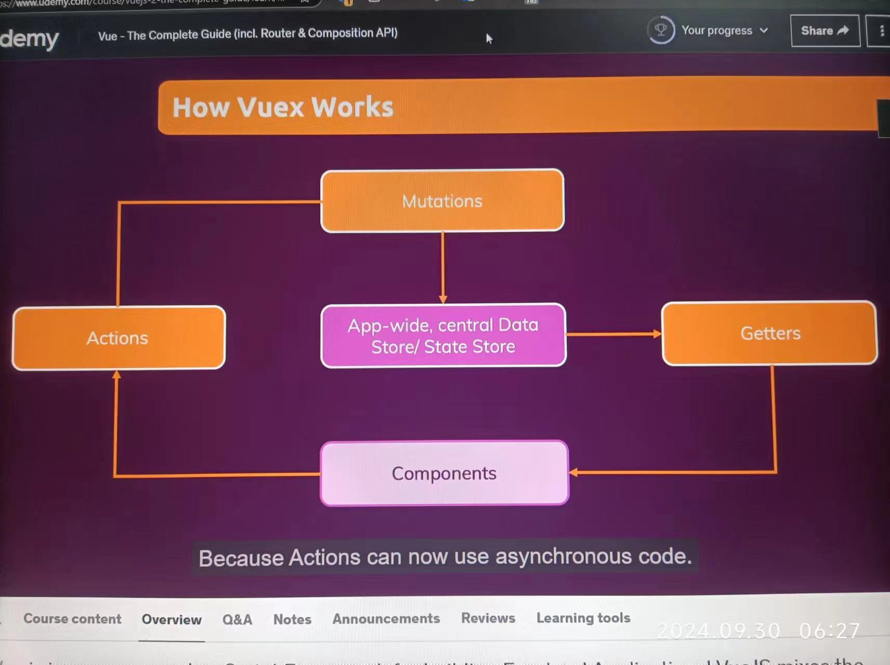

# Section 15: Vuex


### 214 What & Why?

Vuex is a library for managing **global** state

vuex is to overcome:


| problems                                    |                                                              |                                                 |
| ------------------------------------------- | ------------------------------------------------------------ | ----------------------------------------------- |
| fat components                              | unpredictable                                                | error-prone                                     |
| components contains too much data and logic | its not always obvious where data(state) gets changed in which way | accidental or missed state updates are possible |
| with vuex                                   |                                                              |                                                 |
| outsourced state management                 | predictable statement / flow                                 | clearly defined data flow: less errors          |

### 215 Creating & Using a Store

1. download the starting setup project, I have downloaded it( folder demo-code-vuex-01-starting-setup)

2. `npm install`

3. install vuex with `npm install --save vuex`

4. run project with `npm run serve`

5. create and use store in main.js

   ```
   import { createApp } from 'vue';
   import {createStore} from 'vuex';
   
   import App from './App.vue';
   
   const store = createStore({
     state(){
       return {
         counter: 0
       }
     }
   });
   
   const app = createApp(App);
   
   app.use(store);
   
   app.mount('#app');
   ```

6. access the store in App.vue

   ```
   <h3>{{ $store.state.counter}}</h3>
   ```

7. to change the store value:

   ```
       addOne(){
         this.$store.state.counter++;
       }
   ```

   

### 216 Connecting components to state

### 217 mutations

Mutations are clearly defined methods, which have the logic to update the state.

And from inside our components, we should, in the end, just trigger those mutations instead of directly manipulating the state.

If you have multiple locations that add one to counter, if you need to add TWO instead, you have edit multiple places.

to use mutations:

**definition**

```
const store = createStore({
  state(){
    return {
      counter: 0
    }
  },
  mutations: {
    increment(state) {
      state.counter = state.counter + 2;
    }
  }
});

```


**use:**

```
addOne(){
      this.$store.commit('increment');
    }
```

### 218 Passing Data to Mutations with Payloads

- payload is like a method parameter
- it's the second parameter of mutation
- it can be anything, string, number or an object

**definition**

```
    increase(state, payload) {
      state.counter = state.counter + payload;
    }
```

**usage:**

```
addOne(){
      this.$store.commit('increase', 10);
    }
```

### 219 Introducing Getters - A Better Way Of Getting Data

problem: if you need to get `counter * 2` instead of `counter`, and you have multiple places that access counter with `this.$store.state.counter;`, you have to modify each

so we use getters

getters:

```
  getters: {
    finalCounter(state){
      return state.counter * 2;
    }
  }
```

use getters:

```
counter(){
      return this.$store.getters.finalCounter;
    }
```

#### getter that based on other getters

```
  getters: {
    finalCounter(state){
      return state.counter * 2;
    },
    normalizedCounter(_, getters){
      const finalCounter = getters.finalCounter;
      if(finalCounter < 0){
        return 0;
      }else if(finalCounter> 100){
        return 100;
      }else{
        return finalCounter;
      }
    }
  }

```

### 220 Running Async Code with Actions

mutations are synchronized, you are not allowed to have asynchronized code in there.

What if you need to run async code? like sending a http request and mutate after you receive response?

You can use actions that allow async code to trigger mutations.



it's considered a good practice in general, to always put Actions between Components and Mutations, even though Components could commit Mutations themselves.

action can use the same name as mutation.

```javascript
  mutations: {
    increment(state) {
      state.counter = state.counter + 2;
    },
    increase(state, payload) {
      state.counter = state.counter + payload.value;
    }
  },
    actions: {
    increment(context){
      setTimeout(function(){
        context.commit('increment');
      }, 2000);
    },
    increase(context, payload){
      setTimeout(function(){
        context.commit('increase', payload);
      }, 2000);      
    }

  }
```

how to use action:

just like calling mutation but with dispatch instead of commit

```
this.$store.dispatch({type: 'increase',value: 2});
```

### 221 Understanding the Action "Context"

we automatically get context object from action method:

```
actions: {
    increase(context, payload){
        console.log('context', context)
    }
}
```

it has 

- `commit` method
- `dispatch` method, you can dispatch another action from this action, you can dispatch multiple actions
- `getter` method for getting values in case you need some value inside action
- `state` , and you can also directly tap into the state, in case getting access to the getters might not be enough. you should not manipulate the state from inside the action though. **always** use a mutation for that

With state, mutations, actions and getters, we get the core concepts vuex uses to manage state application wide which you can then use conveniently from inside any component.

### 222 Using Mapper Helpers - utility feature

#### mapGetters

```
  computed: {
    counter(){
      return this.$store.getters.finalCounter;
    }
  },
```

can be simplified to 

```
import {mapGetters} from 'vuex';

export default {
  computed: {
    ...mapGetters(['finalCounter'])
  },
};
```

mapGetters method takes a array of parameters, which contains all the getters you want to expose

 if you do not want to use default name:

```
<h3>I am two times of store counter: {{ counter }}</h3>
```

```
  computed: {
    ...mapGetters({
      counter: 'finalCounter'
    })
  },
```


#### mapActions

actions have similar utility features: mapActions

```
<button @click='add'>ChangeCounter Add 10</button>
```

```
  methods: {
    add(){
      this.$store.dispatch('increase', {type: 'increase',value: 10});
    }
  }
```

can be replaced by

```
<button @click='increase({value: 11})'>ChangeCounter Add 11 with mapAction</button>
```

```
  methods: {
    ...mapActions(['increase'])
  }
```

or if you want to map to another name:

```
<button @click='add2({value: 11})'>ChangeCounter Add 11 with mapAction</button>
```

```
  methods: {
    add(){
      this.$store.dispatch('increase', {type: 'increase',value: 10});
    },
    ...mapActions({
      add2: 'increase',
      inc: 'increment'
    })
  }
```

### 224 Organizing your Store with Modules

store can be made up of multiple modules. you automatically have one module, the root module

we will take counter into its own module:

```js
// create module object
const counterModule = {
  state(){
    return {
      counter: 0
    }
  },
  mutations: {
    increment(state) {
      state.counter = state.counter + 2;
    },
    increase(state, payload) {
      state.counter = state.counter + payload.value;
    },
  },
  actions: {
    increment(context){
      setTimeout(function(){
        context.commit('increment');
      }, 2000);
    },
    increase(context, payload){
      console.log('action context', context);
      setTimeout(function(){
        context.commit('increase', payload);
      }, 2000);
    },
  },
  getters: {
    finalCounter(state){
      return state.counter * 2;
    },
    normalizedCounter(_, getters){
      const finalCounter = getters.finalCounter;
      if(finalCounter < 0){
        return 0;
      }else if(finalCounter> 100){
        return 100;
      }else{
        return finalCounter;
      }
    },
  }
};

// add module into store
const store = createStore({
  modules: {
    numbers: counterModule
  },
  state(){
  ...
```

everything works as before, as modules merged into a store are all merged on the same level
