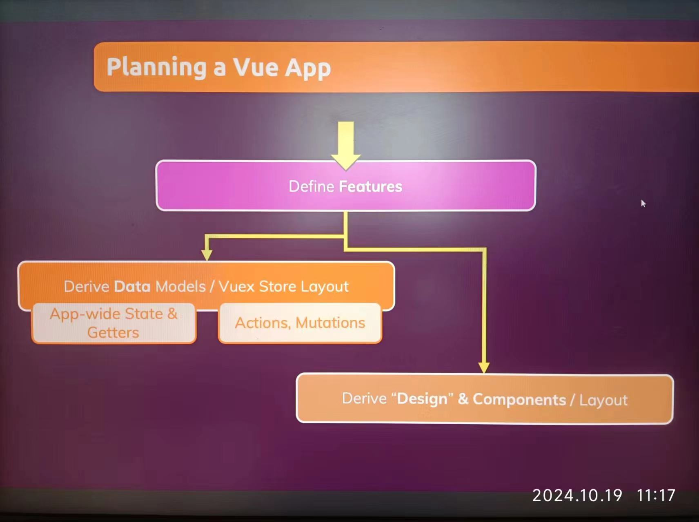
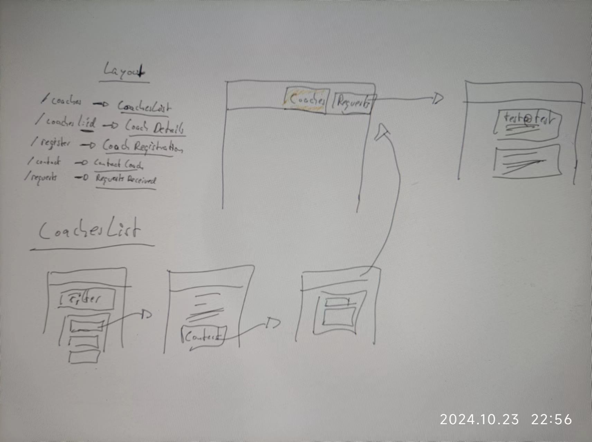

# Section 16 Main Project "Find a Coach" Web app

### 235 Planning the project / Web App



### 236 planning the Data Requirements

#### domain

- coach
  - id
  - first name
  - last name
  - description
  - rate
- request
  - coach id
  - message
  - email

#### mutation

- register
- set coaches
- contact coach
- set requests

### action

- loading coaches from database
- loading requests from database
- add coach
- add request

### 237 Planning the Layout / Components

#### routes

- `/coaches` -> CoachList
- /coaches/:id -> CoachDetails
- /register -> CoachRegistration
- /contact -> ContactCoach
- /request -> RequestReceived
- 

### data

.jpg)

.jpg)

#### pages



## 238 registering routes

1. I downloaded the startup resources accompanied by course 238

2. install vuex and vue-router

   ```
   npm install --save vue-router@next vuex@next
   ```

3. created router.js and added routes